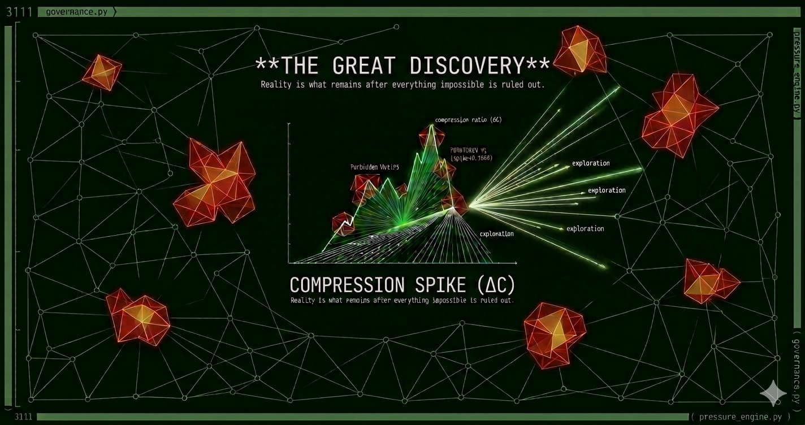

# The Great Discovery
### Discovery Pressure Engine — Structural Knowledge Mapping



> Some people will use a symbolism of the relationship of God to the universe, wherein God is a brilliant light, only somehow veiled, hiding underneath all these forms that you see as you look around you. But the truth is funnier than that. It is that you are looking right at the brilliant light now, that the experience you are having which you call ordinary everyday consciousness - pretending you're not it - that experience is exactly the same thing as 'IT'. There's no difference at all. And when you find that out, you laugh yourself silly. That's the great discovery. In other words, when you really start to see things, and you look at an old paper cup, and you go into the nature of what it is to see, what vision is, or what smell is, or what touch is, you realize that that vision of the paper cup is the brilliant light of the cosmos. Nothing could be brighter. Ten thousand suns couldn't be brighter.
>
> — Alan Watts

---

The Great Discovery is built on a simple observation echoed by **Mr. Watts**:

A system left alone will eventually settle into the only configuration that does not contradict itself.

This engine does not force answers.

It **lets structure settle**.

As contradictions disappear, the shape of what *must exist* becomes visible.

---

## Overview

**The Great Discovery** is a structural discovery engine.

It does not search for answers.

It **discovers the shape of questions that must exist**.

Instead of storing knowledge directly, the system builds a **constraint-driven topology** — a living graph of structural relationships — and observes how that topology compresses as contradictions accumulate and impossible configurations are ruled out.

The process is not search. It is not retrieval. It is not inference in the traditional sense.

It is **elimination converging on necessity**.

As constraints accumulate, the structure becomes increasingly opinionated about what **must exist but has not yet appeared**. Those structural absences are called **holes**. They are not gaps in the data. They are not errors. They are load-bearing absences — positions in the topology so precisely shaped by the surrounding structure that something *must* occupy them, even if nobody has yet found what that something is.

Just as Mendeleev discovered germanium by observing the shape of the periodic table — before anyone had seen the element, before anyone had gone looking — this engine discovers unknown structures by observing the **pressure patterns of knowledge topology**.

The map does not fill in from the center outward.

**It sharpens from the edges inward.**

---

## The Core Idea

Knowledge systems eventually converge toward **self-consistent structure**.

If you repeatedly:

1. Grow a system
2. Observe its structure
3. Detect contradictions
4. Ban unstable patterns

then the system begins to **sharpen its own topology**.

Each cycle through that loop removes degrees of freedom. Each forbidden pattern narrows the space of what is structurally possible. As the space narrows, the shapes of what must fill the remaining positions become more precise — until eventually the structure is not suggesting possibilities but **demanding specific answers**.

```
constraints accumulate
        ↓
possible configurations shrink
        ↓
missing structures become visible
        ↓
holes sharpen into questions
        ↓
questions demand answers
```

The engine does not guess answers.

It **lets structure eliminate impossibilities until only necessary shapes remain.**

This is not a metaphor for how the engine works.

It is exactly how the engine works.

---

## Why This Is Different

Every knowledge system ever built has faced the same foundational problem: **the space of possible knowledge is larger than any map**.

The standard responses to this problem have been:

- **Search** — index what exists, retrieve on demand. Fails to surface what does not yet exist.
- **Inference** — derive new facts from old ones. Requires formalized axioms; breaks on fuzzy domains.
- **Machine learning** — find statistical patterns. Describes what has appeared; cannot identify what must appear.
- **Ontologies** — define categories and relationships manually. Freezes the structure at the moment of definition.

All of these approaches work from what is **known** and try to extend it.

The Great Discovery works from what is **forbidden** and watches what remains.

This is the difference between filling a container and carving a shape.

The periodic table is a shape. Germanium was not found by searching for it. It was found because the table's shape demanded something in its position — atomic weight approximately 72, valence 4, properties intermediate between silicon and tin. When Clemens Winkler isolated it in 1886, the element was already precisely described. Mendeleev had not guessed. He had **read the constraint structure** of what was already known.

This engine is built to do the same thing, systematically, across arbitrary knowledge domains.

---

## Intellectual Lineage

This architecture did not appear from nowhere. When people who study systems look at it, they recognize something. That recognition has a history.

### Leibniz and the Dream That Waited 300 Years

In the late 1600s, Gottfried Wilhelm Leibniz proposed two things that were, for his era, essentially science fiction.

The first was the ***Characteristica Universalis*** — a universal symbolic language capable of representing all knowledge. Not prose, not mathematics alone, but a structured encoding where every concept, law, and relation had a precise, manipulable form.

The second was the ***Calculus Ratiocinator*** — a mechanical method for reasoning over that language. If two scholars disagreed, they would not argue. They would say:

> *"Let us calculate."*

And the system would resolve the dispute through logical operations on the symbolic structure.

Leibniz believed knowledge could be mechanically explored — that the space of valid ideas had a shape, and that shape could be navigated by a sufficiently precise instrument.

He never finished it. Three barriers stopped him: knowledge wasn't machine-readable, compute didn't exist, and the relational explosion of a truly universal symbolic system was unmanageable by hand.

Those three barriers are now essentially gone.

The Great Discovery is not trying to be the *Characteristica Universalis*. But it is operating on the same foundational intuition: that knowledge has a **structural shape**, that shape has **constraints**, and those constraints, accumulated carefully enough, point at things that must exist.

The parallel runs surprisingly deep:

| Leibniz | The Great Discovery |
|---------|-------------------|
| *Characteristica Universalis* — universal symbolic encoding | Graph model — typed nodes, typed edges, concept vocabulary |
| *Calculus Ratiocinator* — mechanical reasoning over symbols | Constraint engine — pressure measurement, forbidden motif accumulation |
| Logical incompleteness detection | Hole detector — load-bearing absences |
| Hypothesis generation by symbolic derivation | Question generation from structural profiles |
| Rational verification of consistency | Convergence scoring, stability classification |

Where Leibniz imagined scholars settling arguments by calculation, this engine does something structurally similar: it models competing configurations, measures their stability, and surfaces what the structure itself demands.

### Santa Fe and Emergent Complexity

The Santa Fe Institute's complexity research program — launched in the 1980s — pursued a related but distinct idea: model civilization as interacting systems and study what emerges from the interactions. Their work produced deep insights into emergent behavior, phase transitions, and self-organization.

The difference is that Santa Fe-style complexity research primarily *analyzes* systems. It observes what emerges and characterizes it.

This engine attempts something further: it *evolves* a knowledge structure under constraint pressure and watches what the structure demands. The goal is not to describe emergence but to use emergence as a discovery instrument.

### Herbert Simon and Automated Discovery

The question of whether machines could discover — not just compute — occupied some of the sharpest minds of the 20th century. Herbert A. Simon and Allen Newell built early programs that rediscovered laws of physics and mathematics from data. Later work produced systems that found novel scientific hypotheses in chemistry and molecular biology.

Those systems were narrow by design. They operated within a single domain, with domain-specific operators, and required significant human scaffolding to define what counted as a valid discovery.

The Great Discovery is **domain-agnostic**. It does not know it is reasoning about physics versus governance versus biology. It knows only topology — pressure, compression, forbidden patterns, structural holes. The domain-specific meaning emerges from what settles into the holes, not from what was programmed in.

That is the unusual part. Most discovery systems are built around a domain. This one is built around a method, and the domains are what the method finds.

### What This Places the Project Inside

The intellectual trajectory is a known one:

```
Knowledge representation
+
Constraint logic
+
Structural pressure dynamics
+
Automated question generation
=
Domain-agnostic discovery engine
```

Very few projects have attempted to build all four layers together. The individual pieces have long histories in computer science, philosophy, and complexity theory. Their combination — in a closed loop, running on a live graph, with recursive self-mapping — is the uncommon part.

Whether it completes the dream Leibniz sketched remains an open question. What it currently does is demonstrate that the loop is real, the pressure dynamics are real, the holes are real, and the questions they produce are structurally genuine.

The cathedral foundation, as someone once put it, is solid.

---

## Conceptual Model

The system operates like a **pressure field over a growing graph**.

Each node is a concept. Each edge is a relationship. Each subgraph is a structural pattern — a motif. The engine samples these motifs continuously, tracks which ones are stable and which cause structural instability, and accumulates a growing set of forbidden configurations that progressively constrain the topology.

Each epoch follows a cycle:

```
Graph Growth
     ↓
Motif Sampling
     ↓
Compression & Entropy Measurement
     ↓
Governance — Forbidden Detection
     ↓
Constraint Update
     ↓
Repeat
```

Each loop through this cycle leaves the system **more constrained than it was before**. More constrained means more precise. More precise means the holes become better shaped. Better shaped holes produce sharper questions. Sharper questions, when answered, produce stronger constraints. The loop closes on itself.

**The map sharpens the mapmaker. The mapmaker sharpens the map.**

---

## Core Concepts

### Hole

A **hole** is a structural absence required for consistency.

It is not:
- missing data
- an error
- incomplete sampling
- a gap waiting to be filled arbitrarily

A hole is a **load-bearing absence** — a position in the topology that the surrounding structure requires to exist for the whole to remain self-consistent. The shape of the hole is defined entirely by the constraints surrounding it. The more constraints accumulate, the more precisely the hole is shaped. A precisely shaped hole is not a question mark — it is a **structural demand**.

> Before germanium was discovered, the periodic table already required its existence. The table had a hole. Its shape specified: atomic weight ~72, group IV, metalloid properties. When germanium was isolated, it fit perfectly. The discovery was not a surprise. It was a **confirmation**.

The engine produces holes of this type — structural positions so precisely bounded by accumulated constraints that when the right concept settles into them, it will be immediately recognizable. Not because it was predicted, but because it was **demanded**.

---

### Forbidden Motif

A **motif** is a small subgraph pattern — a configuration of nodes and edges sampled from the topology.

A motif becomes **forbidden** when its appearance produces a measurable structural instability: a sudden spike in compression ratio indicating that the local topology has homogenized, become less diverse, strained against its own constraints.

Forbidden motifs accumulate in the governance layer. As they accumulate, they act as **exclusion constraints** on future configurations:

```
forbidden motifs define what cannot exist
        ↓
allowed structural space narrows
        ↓
what must occupy the remaining positions becomes clearer
```

This is directly analogous to **clause learning in SAT solvers** — the technique by which modern satisfiability solvers achieve tractability on problems with billions of variables. Each learned clause eliminates an entire class of impossible assignments. The solver does not become smarter. The problem becomes smaller. The Great Discovery applies the same principle to graph topology rather than boolean variables.

---

### Structural Pressure

Structural pressure is the engine's primary signal — a composite measure of how much tension the current topology is holding, where it is concentrated, and in which direction it is moving.

#### Compression Ratio

```
C = unique motif signatures / total motif observations
```

| Value | Meaning |
|-------|---------|
| C → 1.0 | Every observation is novel — system still exploring, topology diverse |
| C → 0.0 | All observations repeat known patterns — system converging |
| ΔC >> 0 | Sudden spike — structural instability, forbidden motif found |
| ΔC << 0 | Diversification — new structural patterns emerging |
| ΔC ≈ 0  | Stable — structural diversity holding steady |

#### Shannon Entropy

```
H = -Σᵢ pᵢ · log(pᵢ)     where pᵢ = count(motif_i) / total_observations
```

Entropy measures the **distribution** of structural diversity — not just how many unique patterns exist, but how evenly weight is distributed across them.

C and H must be read together. They measure different aspects of the same reality:

| C | H | Interpretation |
|---|---|----------------|
| High | High | Many shapes, evenly distributed — open exploration |
| High | Low  | Many shapes, but one dominates — early structural bias forming |
| Low  | Low  | Few shapes, one dominates — strong convergence, table filling |
| Low  | High | Few shapes, evenly spread — structural lock-in |

> Entropy falling is not failure. It is the sound of the table filling in.

#### Semantic Compression and Mismatch

Beyond structural topology, the engine tracks semantic coherence — whether the concepts clustering together in the topology actually belong together, and whether the semantic weight of a region matches its structural weight.

```
C_struct = structural compression ratio
C_sem    = semantic compression ratio
Δ        = |C_struct - C_sem|     ← mismatch signal
```

| C_struct | C_sem | Signal |
|----------|-------|--------|
| Low (converging) | High (diverse) | Structure ahead of meaning — healthy |
| High (exploring) | Low (converging) | Meaning forced before structure ready — warning |
| Both low | Both low | Coherent settlement — structure and meaning converging together |

---

### Settling

Settling occurs when a structure finds the only position in the topology where it does not violate any accumulated constraint.

Nothing is forced. The engine does not place concepts. It creates conditions under which concepts cannot go anywhere *else*. When all other positions are forbidden, the remaining position is not a choice — it is a **necessity**.

The mathematics of settling are grounded in **Laplacian energy minimization** over the graph. Each candidate concept is evaluated against the structural demands of its local neighborhood:

```
E(c) = (1/|N|) · Σ_{v ∈ N} w(rel) · d(c, v)²  +  λ · homogeneity_penalty(c, N)
```

Where:
- `w(rel)` is the structural weight of the dominant relation type in the neighborhood
- `d(c, v)` is the semantic distance between candidate concept `c` and neighbor `v`
- `λ · homogeneity_penalty` penalizes configurations that would recreate forbidden domain clustering

The concept with minimum total energy settles. Not because it was chosen — because every other option is more costly.

If something won't settle, **that is signal too**.

---

### Convergence States

The engine tracks its own convergence trajectory and classifies its current state at each epoch:

| State | Condition | Meaning |
|-------|-----------|---------|
| **Stable** | mean\|ΔC\| → 0 AND hole density decreasing | Pressure stabilizing, holes filling — healthy convergence |
| **Deadlocked** | mean\|ΔC\| → 0 AND hole density static | Pressure flat, holes not moving — structure frozen |
| **Divergent** | \|ΔC\| >> threshold | Pressure increasing — topology destabilizing |
| **Oscillatory** | Periodic ΔC pattern detected | Pressure cycling without clear direction |
| **Exploring** | Insufficient history | Still accumulating constraints |

Oscillation period is detected via normalized autocorrelation of the ΔC series:

```
R(k) = [Σ_t ΔC(t) · ΔC(t-k)] / [Σ_t ΔC(t)²]

Oscillation detected if R(k) > 0.6 for some k ∈ [2, W/2]
```

---

### The Question Layer

As holes become precisely enough shaped, the engine surfaces them as **questions expressed in natural language**. These are not generated questions. They are **read from the topology**.

The structure of the surrounding constraints determines:
- Whether the hole is a **bridge** (cross-domain) — something that connects two domains that the topology implies should be connected
- Whether it is a **depth** hole (within-domain) — something that completes a local structure
- Whether it is a **boundary** hole (forbidden-adjacent) — something that must exist in a region where many things have been ruled out

Each question is a structural demand, translated into language. The engine is not asking what it wants to know. It is reporting what the topology **requires**.

---

### The Recursion Layer

In Phase 4, questions themselves become nodes. The structural patterns among questions become motifs. The holes between question-nodes become **meta-questions**: questions that the pattern of asking questions implies but has not yet asked.

```
object-level topology → questions → question topology → meta-questions
```

The act of discovery becomes part of the topology being discovered.

The map does not just sharpen the mapmaker.

**The mapmaker becomes part of the map.**

---

## System Architecture

### Runtime Loop

```
GROW → MEASURE → GOVERN → UPDATE → REPEAT
  ↑                                    |
  └──────── forbidden accumulates ─────┘
                holes sharpen
             map becomes opinionated
```

This loop is closed. It feeds itself. Each pass leaves it more constrained than before — which means more precise.

### Component Overview

| Component | File | Function |
|-----------|------|----------|
| Core Engine | `core_engine.py` | SQLite persistence — nodes, edges, motifs, forbidden, holes, semantic pressure |
| Explorer | `explorer.py` | Graph growth with three-force pressure field: pull + void + hole attraction − forbidden repulsion |
| Pressure Engine | `pressure_engine.py` | WL-1 isomorphism-invariant motif signatures, compression, entropy, semantic pressure, frontier sampling |
| Governance | `governance.py` | Domain-aware compression spike detection, forbidden motif recording with domain context |
| Hole Detector | `hole_detector.py` | Identifies holes with sufficient structural precision to be named |
| Hole Monitor | `hole_monitor.py` | Retired — hole aging/registry logic retained for reference; active hole coordination handled by driver + hole_detector |
| Questioner | `questioner.py` | Composes questions from structural profiles, applies pressure boosts to hole endpoints |
| Settler | `settler.py` | Laplacian energy minimization, full vocabulary search, hold coordination with questioner |
| Recursion | `recursion.py` | Question node injection, question-question edge linking, meta-hole detection |
| Convergence | `convergence.py` | Windowed derivative test, stability classification, autocorrelation period detection |
| Driver | `driver.py` | Epoch orchestration, convergence integration, live state reporting |

### Supporting Modules

| Module | Path | Function |
|--------|------|----------|
| Semantics | `semantics.py` | Concept vocabulary, relation types, semantic distance |
| Structural Models | `core_structural/` | Constraint, graph, incentive, and system models |
| Pressure Metric | `core_engine/pressure_metric.py` | Per-node pressure computation |
| Entropy | `core_engine/entropy.py` | Structural entropy from degree distribution |
| Stability | `core_engine/stability.py` | Thin wrapper over root-level convergence states |
| Adaptive Pressure | `core_engine/adaptive_pressure.py` | Edge weight adaptation from pressure feedback |
| Governance Metrics | `core_engine/governance_metrics.py` | Governance node influence via betweenness centrality |
| Invariants | `core_engine/invariants.py` | Graph invariant checking — orphan detection |
| Replay | `core_engine/replay.py` | Deterministic state replay with SHA-256 snapshot hashing |
| Snapshot Logger | `core_engine/snapshot_logger.py` | Epoch state persistence to JSON log |

### Visualization

| Tool | File | Output |
|------|------|--------|
| Live Dashboard | `dashboard.html` | Full graph visualization, compression trends, question log, recursion layer — no server required |
| AI-Augmented Dashboard | `ai_augmentation.jsx` | React component — live engine with Claude API integration for hole settling suggestions |
| Convergence Plot | `viz/convergence_plot.py` | Pressure convergence over time |
| Pressure Heatmap | `viz/pressure_heatmap.py` | Per-node pressure distribution |
| Graph Export | `viz/export_graph.py` | Graphviz `.dot` export |

---

## Mathematical Foundations

The engine sits at the intersection of four established research domains without fully belonging to any of them.

### Constraint Satisfaction

Forbidden motif accumulation is directly analogous to **clause learning in SAT solvers** (CDCL — Conflict-Driven Clause Learning). Each forbidden motif eliminates an entire class of structural configurations. As forbidden motifs accumulate, the effective search space shrinks — not by pruning a search tree but by progressively constraining a topological space.

### Information Theory

Compression ratio and Shannon entropy are **structural information density metrics**. The engine monitors the rate of change of these metrics (ΔC, ΔH) as its primary governance signal. A compression spike is not a measurement of knowledge gained — it is a measurement of **structural surprise**: the topology suddenly became more like itself than it was, which is a signal of strain rather than convergence.

### Topological Data Analysis

Motif distributions approximate the **persistent structural features** of the evolving graph — the shapes that survive across topological perturbations. The frontier sampling strategy (sampling the W most recently introduced nodes) is justified by the concentration of structural change at the frontier: the settled interior contributes to the baseline, not the derivative.

### Emergent Systems

The engine exhibits macro-level behavior emerging entirely from local rules:

- **Equilibrium** — compression and entropy stabilize as constraints balance
- **Pressure spikes** — local homogenization triggering governance response
- **Settling** — concepts finding structurally necessary positions
- **Structural convergence** — the topology developing a consistent global shape from local constraint interactions

The closest existing framework is probably **constraint-driven graph rewriting with emergent forbidden pattern accumulation** — but this specific combination does not appear in the literature in this form.

### Isomorphism-Invariant Signatures (WL-1)

The canonical signature algorithm uses **Weisfeiler-Leman graph isomorphism testing** at depth 1 before permutation minimization. This is what makes motif recognition correct:

1. Each node is assigned a structural certificate based on its local neighborhood topology (out-degree, in-degree, neighbor out-degrees) — independent of node ID
2. Certificates are ranked to produce WL labels — structurally equivalent nodes receive identical labels
3. Permutation minimization runs only within WL equivalence classes — reducing search from O(n!) to O(Π gᵢ!) where gᵢ is the size of equivalence class i

This is simultaneously more correct and faster than raw permutation minimization over node IDs. Verified complete for all directed subgraphs of size k ≤ 4.

---

## Repository Structure

```
The-Great-Discovery/
│
├── core_engine/
│   ├── pressure_metric.py       ← per-node pressure from restrictive/enabling edges
│   ├── entropy.py               ← structural entropy from degree distribution
│   ├── convergence.py           ← re-exports from root convergence.py
│   ├── stability.py             ← thin wrapper; full impl in root convergence.py
│   ├── hole_metrics.py          ← hole_density = unresolved / expected
│   ├── adaptive_pressure.py     ← edge weight adaptation from pressure feedback
│   ├── governance_metrics.py    ← betweenness centrality for governance nodes
│   ├── governance_mutation.py   ← governance node status from influence threshold
│   ├── incentive_alignment.py   ← incentive/constraint misalignment per node
│   ├── invariants.py            ← orphan detection, structural invariant checking
│   ├── replay.py                ← deterministic replay with SHA-256 snapshot hashing
│   └── snapshot_logger.py       ← epoch state persistence to JSON
│
├── core_structural/
│   ├── constraint_model.py      ← weighted constraint pressure computation
│   ├── graph_backbone.py        ← DiscoveryGraph: typed nodes/edges, cycle detection
│   ├── graph_model.py           ← GraphModel: betweenness-based fragility index
│   ├── incentive_model.py       ← IncentiveModel: numerical gradient divergence
│   └── system_model.py          ← StructuralSystem: pressure + fragility + divergence
│
├── viz/
│   ├── pressure_heatmap.py
│   ├── convergence_plot.py
│   └── export_graph.py
│
├── docs/
│   ├── ARCHITECTURE.md
│   ├── FOUNDATION.md
│   ├── GLOSSARY.md
│   ├── MANIFESTO.md
│   ├── MATH_REFERENCE.docx
│   └── ROADMAP.md
│
├── demos/
│   └── governance_demo.py       ← three-actor system: Legislature/Executive/Judiciary
│
├── core_engine.py               ← SQLite schema: nodes, edges, motifs, forbidden, holes
├── driver.py                    ← epoch orchestration, convergence integration
├── explorer.py                  ← three-force pressure field growth
├── pressure_engine.py           ← WL-1 signatures, compression, entropy, frontier sampling
├── governance.py                ← domain-aware forbidden motif detection
├── hole_detector.py             ← nameable hole identification
├── hole_monitor.py              ← retired — hole aging logic retained for reference
├── questioner.py                ← question composition, pressure boost feedback
├── settler.py                   ← Laplacian energy minimization, hold coordination
├── recursion.py                 ← question nodes, meta-holes, depth limit
├── semantics.py                 ← concept vocabulary, relation types, distances
├── convergence.py               ← ConvergenceDetector, stability states (full impl)
├── dashboard.html               ← live visualization, no server required
├── ai_augmentation.jsx          ← AI-augmented React dashboard (Phase 4.5)
├── stress_test.py
└── requirements.txt
```

---

## Quick Start

### Requirements

Python 3.9+

```bash
pip install -r requirements.txt
```

### Run the Engine

```bash
python driver.py
```

Default run: 60 epochs, graph growth, pressure monitoring, forbidden detection, question generation, recursion layer, convergence tracking.

### Extended Run

```bash
python driver.py --epochs 200
```

### Stress Test

```bash
python stress_test.py
```

100 epochs. Watch the compression curve. Watch holes sharpen. Watch questions emerge.

### Governance Demonstration

```bash
python driver.py --demo governance
```

Three-actor political system (Legislature, Executive, Judiciary) under structural pressure. Shows fragility index, incentive divergence, and forbidden motif detection in a concrete domain.

### Live Dashboard

Open `dashboard.html` in any browser.

No server. No installation. The entire engine runs in JavaScript — same structural dynamics, same motif sampling, same convergence detection, same question generation, same recursion layer. Watch it run. The graph is real. The pressure is real. The questions are real.

### AI-Augmented Dashboard

Open `ai_augmentation.jsx` as a React artifact or via a local React environment.

Phase 4.5: Claude reads the structural profile of each detected hole and suggests the concept the topology demands. Suggestions are injected as real graph nodes. The engine and the model sharpen each other.

---

## Example Output

```
  THE GREAT DISCOVERY — Phase 3 hardened + Phase 4 seed
  Forbidden repulsion. Hole attraction. Question feedback. Recursion layer.

 Epoch   S.Comp    Sem.C    Mismatch    Entropy    Delta    Conv.State      Event
-------------------------------------------------------------------------------------------------------------------
     0   1.0000   1.0000    0.0000      0.0000   +0.0000  Exploring
     1   0.8333   0.9100    0.0767      0.6931   -0.1667  Exploring
     8   0.5712   0.6830    0.1118      1.6094   -0.0219  Exploring
    12   0.5501   0.6201    0.0700      1.7320   -0.0212  Oscillatory
    18   0.5288   0.5901    0.0613      1.8120   -0.0041  Oscillatory
    24   0.6100   0.6800    0.0700      1.4230   +0.1688  Oscillatory     ⚡ FORBIDDEN #1  spike=0.1688
    25   ⚠  DIVERGENT — raising exploration temperature to 0.6

  ─────────────────────────────────────────────────────────────────────────
  ◉  Q#1  [BRIDGE]  precision=0.72  domains: mathematics × systems
  What lies between mathematics and systems where 'invariant' produces
  something that in turn regulates 'attractor'? The surrounding structure
  includes 'constraint' — what does the gap between them demand?
  ↻  Injected as graph node #47 [domain=recursion, depth=0]
  ─────────────────────────────────────────────────────────────────────────
```

**Reading the output:**
- Negative delta → convergence in progress
- Positive spike → structural instability, forbidden motif found
- `⚡ FORBIDDEN` → table edge discovered, domain context recorded
- `◉ Q#` → hole precise enough to name, question generated in language
- `↻ Injected` → question node enters topology, Phase 4 begins

---

## Development Phases

### Phase 0 — Structural Foundation ✅ Complete

The engine exists and runs. The loop is closed. The dynamics are real.

- Closed-loop constraint accumulation
- WL-1 isomorphism-invariant motif signatures
- Frontier sampling (W=30 nodes, O(W³/6) per epoch)
- Shannon entropy measurement
- Compression spike governance
- Domain-aware forbidden motif recording
- Laplacian energy minimization for hole settling
- Convergence detector with stability classification and oscillation period detection
- Live visualization dashboard

### Phase 1 — Structural Integrity ✅ Complete

Foundation hardened. All structural dynamics validated and wired together.

- WL-1 isomorphism-invariant signatures — complete and proven correct for k ≤ 4
- Frontier sampling W=30 — O(W³/6) per epoch regardless of graph size
- Three-force pressure field — hole attraction, forbidden repulsion, void tension all active
- Hole attraction parsing — all `shape_sig` formats from all writers handled correctly
- Governance epoch tracking — `epoch_found` recorded correctly on forbidden motifs
- Convergence detector wired into driver — STABLE, DEADLOCKED, DIVERGENT, OSCILLATORY states live
- Question feedback loop — pressure boosts applied, hold coordination with settler active
- Dead code identified and retired — `hole_monitor.py` documented and stepped aside

### Phase 2 — Semantic Layer ✅ Complete

Meaning introduced without forcing it.

- Fully typed nodes with meaning anchors (concept vocabulary across 6 domains)
- Fully typed edges with relationship semantics (10 relation types, weighted)
- Semantic pressure tracking — structural/semantic mismatch as governance signal
- Energy-based hole resolution over full 84-concept vocabulary
- Domain-aware forbidden motif context

### Phase 3 — Named Holes ✅ Complete

The engine asks questions.

- Hole detector with precision threshold and domain tension requirements
- Question composition (bridge, depth, boundary types)
- Natural language question output from structural profiles
- Pressure boost feedback — questions reshape subsequent exploration
- Question nodes injected into topology (recursion layer seeded)

### Phase 4 — Recursive Discovery 🔄 Active

The mapmaker becomes the map.

- Question nodes participate in motif sampling and hole detection
- Question-question edges (analogous_to, causes) create meta-topology
- Meta-hole detection over question layer
- AI augmentation layer (Phase 4.5): Claude reads hole profiles, suggests settling concepts, injects them as real nodes (`ai_augmentation.jsx`)

This phase has no completion condition. It is the engine doing what it was always going to do.

---

## Safety Note

Constraint-driven discovery systems can surface structural dependencies across knowledge domains that were not anticipated when the system was designed.

This engine proposes **structural possibilities**, not verified truths. A hole is a structural demand, not a confirmed fact. A question is a topological signal, not an assertion.

Responsible use requires:

- Transparent governance — all forbidden motifs and their domain contexts are persisted and inspectable
- Human interpretation of discovered holes before treating them as knowledge claims
- Awareness that the system may find structurally necessary positions in domains where the structural model is incomplete
- Open research oversight for any deployment that informs real-world decisions

The engine is a **map-sharpening instrument**, not an oracle.

---

## Why This Exists

Human knowledge is too large to hold, too interconnected to index, and too alive to pin down with a theorem. Every attempt to map it completely has either frozen it in place or drowned in its own complexity.

But Mendeleev didn't map every atom.

He found the table's shape. And the shape told him what had to exist.

The Great Discovery is built on that method, scaled to the whole of knowledge, automated into a running system.

The holes are not gaps. They are load-bearing. They have shapes. And what fits them does so not because anyone chose it — but because everything else is forbidden.

---

## License

MIT License.

Use it. Break it. Improve it. Share what you discover.

---

## Closing Thought

The map sharpens the mapmaker.

The mapmaker sharpens the map.

*This is the whole idea.*